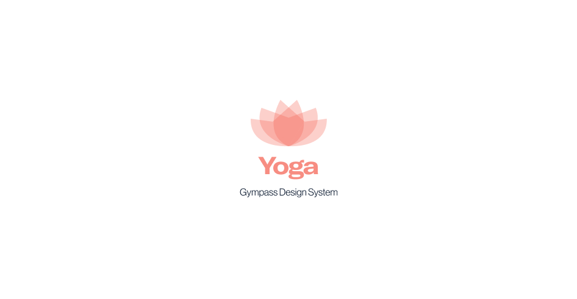

  

Design system at Gympass, our main intent is to support our projects.
We have open-sourced our project for those who are interested in checkout how we do things and organize our code and documentation here.

### What does it mean?

> Yoga is a scientific system of practices made to help each one of us achieve our highest potential and experience.

## Documentation

Yoga is documented at [http://gympass.github.io/yoga](https://gympass.github.io/yoga).

## Architecture

Our codebase is a monorepo and individually versioned libraries.
Here's an overview of our packages:

| Package                                      | Version                                                                                                               | Size                                                                                                                                    |
| -------------------------------------------- | --------------------------------------------------------------------------------------------------------------------- | --------------------------------------------------------------------------------------------------------------------------------------- |
| [`@gympass/yoga`](/packages/yoga)            |                  |                  |
| [`@gympass/yoga-tokens`](/packages/tokens)   |    |    |
| [`@gympass/yoga-common`](/packages/common)   |    |    |
| [`@gympass/yoga-icons`](/packages/icons)     |      |      |
| [`@gympass/yoga-helpers`](/packages/helpers) |  |  |
| [`@gympass/yoga-system`](/packages/system)   |    |    |

## Contributing

This repository should _and_ will grow, its contents will be used for many people in our current and future
projects. As such, we follow some practices to keep a common architecture in our changes.

### [Code of Conduct](https://github.com/stumpsyn/policies/blob/master/citizen_code_of_conduct.md)

We adopted the _Citizen Code of Condute_, which is widely used in many projects and communities such the [Rust comunity](https://www.rust-lang.org/policies/code-of-conduct).
Please read the [full text](https://github.com/stumpsyn/policies/blob/master/citizen_code_of_conduct.md) so that you can understand what actions will and will not be tolerated.

### [Contributing Guide](CONTRIBUTING.md)

Read our [contributing guide](CONTRIBUTING.md) to learn about our development process, how to propose bugfixes and improvements, and how to build and test your changes to Yoga.

## Contributors ✨

Thanks goes to these wonderful people ([emoji key](https://allcontributors.org/docs/en/emoji-key)):

<!-- ALL-CONTRIBUTORS-LIST:START - Do not remove or modify this section -->
<!-- prettier-ignore-start -->
<!-- markdownlint-disable -->
<table>
  <tr>
    <td align="center"><a href="https://twitter.com/ggdaltoso"> <b>Gabriel Daltoso</b></a> <a href="https://github.com/Gympass/yoga/commits?author=ggdaltoso" title="Code">💻</a> <a href="#ideas-ggdaltoso" title="Ideas, Planning, & Feedback">🤔</a> <a href="https://github.com/Gympass/yoga/commits?author=ggdaltoso" title="Documentation">📖</a> <a href="https://github.com/Gympass/yoga/pulls?q=is%3Apr+reviewed-by%3Aggdaltoso" title="Reviewed Pull Requests">👀</a></td>
    <td align="center"><a href="https://twitter.com/_allyssonsantos"> <b>Allysson dos Santos</b></a> <a href="https://github.com/Gympass/yoga/commits?author=allyssonsantos" title="Code">💻</a> <a href="#ideas-allyssonsantos" title="Ideas, Planning, & Feedback">🤔</a> <a href="https://github.com/Gympass/yoga/commits?author=allyssonsantos" title="Documentation">📖</a> <a href="https://github.com/Gympass/yoga/pulls?q=is%3Apr+reviewed-by%3Aallyssonsantos" title="Reviewed Pull Requests">👀</a></td>
    <td align="center"><a href="https://br.linkedin.com/in/victor-matheus-jesus-caetano-9633b5118"> <b>Victor Caetano</b></a> <a href="https://github.com/Gympass/yoga/commits?author=victormath12" title="Code">💻</a> <a href="#ideas-victormath12" title="Ideas, Planning, & Feedback">🤔</a> <a href="https://github.com/Gympass/yoga/commits?author=victormath12" title="Documentation">📖</a> <a href="https://github.com/Gympass/yoga/pulls?q=is%3Apr+reviewed-by%3Avictormath12" title="Reviewed Pull Requests">👀</a></td>
    <td align="center"><a href="https://twitter.com/oalanoliv"> <b>Alan Oliveira</b></a> <a href="https://github.com/Gympass/yoga/commits?author=alan-oliv" title="Code">💻</a> <a href="#ideas-alan-oliv" title="Ideas, Planning, & Feedback">🤔</a> <a href="https://github.com/Gympass/yoga/commits?author=alan-oliv" title="Documentation">📖</a> <a href="https://github.com/Gympass/yoga/pulls?q=is%3Apr+reviewed-by%3Aalan-oliv" title="Reviewed Pull Requests">👀</a></td>
    <td align="center"><a href="http://linkedin.com/in/kaicbastidas"> <b>Kaic Bastidas</b></a> <a href="https://github.com/Gympass/yoga/commits?author=tcK1" title="Code">💻</a> <a href="#ideas-tcK1" title="Ideas, Planning, & Feedback">🤔</a> <a href="https://github.com/Gympass/yoga/commits?author=tcK1" title="Documentation">📖</a></td>
    <td align="center"><a href="https://github.com/luispiresgympass"> <b>Luis Pires</b></a> <a href="https://github.com/Gympass/yoga/commits?author=luispiresgympass" title="Code">💻</a></td>
    <td align="center"><a href="https://github.com/invilliaanajacobsen"> <b>invilliaanajacobsen</b></a> <a href="https://github.com/Gympass/yoga/issues?q=author%3Ainvilliaanajacobsen" title="Bug reports">🐛</a></td>
  </tr>
  <tr>
    <td align="center"><a href="http://www.caioalexandre.com"> <b>Caio Alexandre</b></a> <a href="https://github.com/Gympass/yoga/commits?author=caioalexandrebr" title="Documentation">📖</a></td>
    <td align="center"><a href="https://github.com/thayllachristine"> <b>Thaylla Christine</b></a> <a href="https://github.com/Gympass/yoga/commits?author=thayllachristine" title="Code">💻</a></td>
    <td align="center"><a href="https://github.com/evilamaior"> <b>Esthéfanie Vila Maior</b></a> <a href="https://github.com/Gympass/yoga/commits?author=evilamaior" title="Documentation">📖</a> <a href="https://github.com/Gympass/yoga/commits?author=evilamaior" title="Code">💻</a></td>
    <td align="center"><a href="http://geovanasilva.dev/"> <b>Geovana Silva</b></a> <a href="https://github.com/Gympass/yoga/issues?q=author%3Ageovanasilva" title="Bug reports">🐛</a></td>
    <td align="center"><a href="https://lucascoelho.dev/"> <b>Lucas Coelho</b></a> <a href="https://github.com/Gympass/yoga/commits?author=coelhucas" title="Code">💻</a> <a href="#ideas-coelhucas" title="Ideas, Planning, & Feedback">🤔</a> <a href="https://github.com/Gympass/yoga/commits?author=coelhucas" title="Documentation">📖</a></td>
    <td align="center"><a href="https://github.com/andrerocha22"> <b>André Rocha</b></a> <a href="https://github.com/Gympass/yoga/commits?author=andrerocha22" title="Documentation">📖</a> <a href="https://github.com/Gympass/yoga/commits?author=andrerocha22" title="Code">💻</a></td>
    <td align="center"><a href="https://medium.com/@katharinep"> <b>Katharine Padilha</b></a> <a href="https://github.com/Gympass/yoga/commits?author=katharinepadilha" title="Code">💻</a> <a href="#ideas-katharinepadilha" title="Ideas, Planning, & Feedback">🤔</a></td>
  </tr>
  <tr>
    <td align="center"><a href="https://github.com/tjamancio"> <b>Thiago Amâncio</b></a> <a href="#design-tjamancio" title="Design">🎨</a> <a href="https://github.com/Gympass/yoga/issues?q=author%3Atjamancio" title="Bug reports">🐛</a></td>
    <td align="center"><a href="https://www.linkedin.com/in/alycecristines/"> <b>Alyce Cristine</b></a> <a href="https://github.com/Gympass/yoga/commits?author=alycecristines" title="Code">💻</a> <a href="https://github.com/Gympass/yoga/commits?author=alycecristines" title="Documentation">📖</a></td>
    <td align="center"><a href="https://github.com/nypacheco"> <b>Nathália Pacheco</b></a> <a href="https://github.com/Gympass/yoga/commits?author=nypacheco" title="Code">💻</a> <a href="https://github.com/Gympass/yoga/commits?author=nypacheco" title="Documentation">📖</a></td>
    <td align="center"><a href="https://github.com/matheushenrique1"> <b>Matheus Henrique</b></a> <a href="https://github.com/Gympass/yoga/commits?author=matheushenrique1" title="Documentation">📖</a></td>
    <td align="center"><a href="http://www.linkedin.com/in/dariofelipe"> <b>Dário Felipe</b></a> <a href="https://github.com/Gympass/yoga/commits?author=Dario-Felipe" title="Documentation">📖</a></td>
    <td align="center"><a href="https://joaovicdsantos.github.io/"> <b>João Victor</b></a> <a href="https://github.com/Gympass/yoga/commits?author=joaovicdsantos" title="Documentation">📖</a></td>
    <td align="center"><a href="http://wendler.dev"> <b>Wendler Eis</b></a> <a href="https://github.com/Gympass/yoga/issues?q=author%3AWendlereis" title="Bug reports">🐛</a></td>
  </tr>
  <tr>
    <td align="center"><a href="https://github.com/dehmirandac2"> <b>Deborah Miranda</b></a> <a href="https://github.com/Gympass/yoga/issues?q=author%3Adehmirandac2" title="Bug reports">🐛</a></td>
  </tr>
</table>

<!-- markdownlint-restore -->
<!-- prettier-ignore-end -->

<!-- ALL-CONTRIBUTORS-LIST:END -->

This project follows the [all-contributors](https://github.com/all-contributors/all-contributors) specification. Contributions of any kind welcome!
