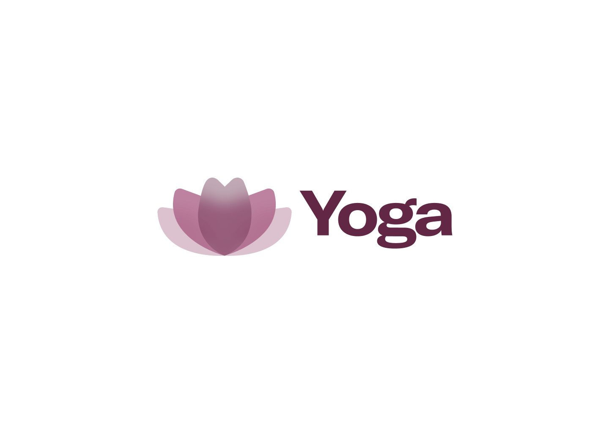

<p align="center">
  
</p>

<!-- ALL-CONTRIBUTORS-BADGE:START - Do not remove or modify this section -->

[](#contributors)

<!-- ALL-CONTRIBUTORS-BADGE:END -->


Design system at Wellhub, our main intent is to support our projects. We have open-sourced our project for those who are interested in checkout how we do things and organize our code and documentation here.

**What does it mean?**

Yoga is a scientific system of practices made to help each one of us achieve our highest potential and experience.

## Documentation

Yoga is documented at [http://gympass.github.io/yoga](https://gympass.github.io/yoga).

## Installing

In order to install our design-system just run:

```bash
$ yarn add @gympass/yoga
```

## Usage

An important point is that your whole application must be wrapped in our ThemeProvider component:

```bash
import { ThemeProvider, Button } from '@gympass/yoga';

const App = () => (
  <ThemeProvider>
    <Button>Find an activity</Button>
  </ThemeProvider>
);

```

## Architecture

The Yoga Design System codebase is structured as a monorepo, containing individually versioned libraries. Below is an overview of the main packages:

| Package                                                  | Version                                                                                                                           | Size                                                                                                                                                | Description                                                    |
| -------------------------------------------------------- | --------------------------------------------------------------------------------------------------------------------------------- | --------------------------------------------------------------------------------------------------------------------------------------------------- | -------------------------------------------------------------- |
| [`@gympass/yoga`](/packages/yoga)                        | [](https://www.npmjs.com/package/@gympass/yoga)                             | [](https://bundlephobia.com/result?p=@gympass/yoga)                             | Main package that brings together and exports all components   |
| [`@gympass/yoga-tokens`](/packages/tokens)               | [](https://www.npmjs.com/package/@gympass/yoga-tokens)               | [](https://bundlephobia.com/result?p=@gympass/yoga-tokens)               | Contains the design tokens used to maintain visual consistency |
| [`@gympass/yoga-common`](/packages/common)               | [](https://www.npmjs.com/package/@gympass/yoga-common)               | [](https://bundlephobia.com/result?p=@gympass/yoga-common)               | Contains some helper variables used in all packages            |
| [`@gympass/yoga-icons`](/packages/icons)                 | [](https://www.npmjs.com/package/@gympass/yoga-icons)                 | [](https://bundlephobia.com/result?p=@gympass/yoga-icons)                 | Library of icons used in components                            |
| [`@gympass/yoga-illustrations`](/packages/illustrations) | [](https://www.npmjs.com/package/@gympass/yoga-illustrations) | [](https://bundlephobia.com/result?p=@gympass/yoga-illustrations) | Library of illustrations used in components                    |
| [`@gympass/yoga-helpers`](/packages/helpers)             | [](https://www.npmjs.com/package/@gympass/yoga-helpers)             | [](https://bundlephobia.com/result?p=@gympass/yoga-helpers)             | Helper functions to make yoga components easier to use         |
| [`@gympass/yoga-system`](/packages/system)               | [](https://www.npmjs.com/package/@gympass/yoga-system)               | [](https://bundlephobia.com/result?p=@gympass/yoga-system)               | Tools to apply themes and styles based on design tokens        |

## Support

**Browser:** We support the 3 latest and stable releases of all major browsers and platforms

| Browser          | Version |
| ---------------- | ------- |
| Chrome           | >= 125  |
| Chrome (Android) | >= 125  |
| Safari (macOS)   | >= 15   |
| Safari (iOS)     | >= 15   |
| Edge             | >= 125  |
| Firefox          | >= 125  |

**Operational System:** Yoga provides support for iOS 14 and higher and Android 7 and higher.

| OS      | Version | Viewport Size                          |
| ------- | ------- | -------------------------------------- |
| Android | >= 7    | Android Large: 360 x 800 (Samsung S20) |
| iOS     | >= 14   | iPhone SE: 320 x 568                   |

**[React](https://react.dev/):** Build user interfaces out of individual pieces called components written in JavaScript. Yoga supports versions `>=16`.

**[React Native](https://reactnative.dev/):** Brings the React programming paradigm to platforms like Android and iOS. Yoga supports version `0.72.3`.

**[Picker](https://www.npmjs.com/package/react-native-picker-select):** A Picker component for React Native which emulates the native interfaces for iOS and Android. Yoga supports versions `^2.4.9`.

**[Styled Componentes](https://styled-components.com/):** This lets you write actual CSS in your JavaScript.Yoga supports versions `^4.4.0`.

## License

Yoga is an open-source collaborative project, in other words, its distribution grants the right to study, use, change and distribute it to anyone (MIT license).

## Report an issue

Check if there is already an [issue](https://github.com/gympass/yoga/issues) open in our repository. If not, you can create a new one. Also, check the [discussion topics](https://github.com/gympass/yoga/discussions). Our team will analyze and prioritize within our initiatives. If you are interested and available, let us know and we will address you ASAP. Wellhub developers should refer to the Internal Guidelines.

## Request a feature

If you believe it is necessary to develop a new feature, for example a new component, please contact our team. You can open a new discussion topic, explaining the need. Our team will analyze and prioritize within our initiatives, taking into account design and engineering principles, such as reusability. If you are interested and available, let us know and we will address you ASAP. Wellhub developers should refer to the Internal Guidelines.

### [Contributing Guide](CONTRIBUTING.md)

This repository should and will grow, its contents will be used for many people in our current and future projects. As such, we follow some practices to keep a common architecture in our changes. Read our [Contributing Guide](CONTRIBUTING.md) to learn about our code of conduct, environments setups and development process. Wellhub developers should also consult the Internal Guidelines.

## Contributors ✨

Thanks goes to these wonderful people ([emoji key](https://allcontributors.org/docs/en/emoji-key)):

<!-- ALL-CONTRIBUTORS-LIST:START - Do not remove or modify this section -->
<!-- prettier-ignore-start -->
<!-- markdownlint-disable -->
<table>
  <tbody>
    <tr>
      <td align="center" valign="top" width="14.28%"><a href="https://twitter.com/ggdaltoso"><br /><sub><b>Gabriel Daltoso</b></sub></a><br /><a href="https://github.com/gympass/yoga/commits?author=ggdaltoso" title="Code">💻</a> <a href="#ideas-ggdaltoso" title="Ideas, Planning, & Feedback">🤔</a> <a href="https://github.com/gympass/yoga/commits?author=ggdaltoso" title="Documentation">📖</a> <a href="https://github.com/gympass/yoga/pulls?q=is%3Apr+reviewed-by%3Aggdaltoso" title="Reviewed Pull Requests">👀</a></td>
      <td align="center" valign="top" width="14.28%"><a href="https://twitter.com/_allyssonsantos"><br /><sub><b>Allysson dos Santos</b></sub></a><br /><a href="https://github.com/gympass/yoga/commits?author=allyssonsantos" title="Code">💻</a> <a href="#ideas-allyssonsantos" title="Ideas, Planning, & Feedback">🤔</a> <a href="https://github.com/gympass/yoga/commits?author=allyssonsantos" title="Documentation">📖</a> <a href="https://github.com/gympass/yoga/pulls?q=is%3Apr+reviewed-by%3Aallyssonsantos" title="Reviewed Pull Requests">👀</a></td>
      <td align="center" valign="top" width="14.28%"><a href="https://br.linkedin.com/in/victor-matheus-jesus-caetano-9633b5118"><br /><sub><b>Victor Caetano</b></sub></a><br /><a href="https://github.com/gympass/yoga/commits?author=victormath12" title="Code">💻</a> <a href="#ideas-victormath12" title="Ideas, Planning, & Feedback">🤔</a> <a href="https://github.com/gympass/yoga/commits?author=victormath12" title="Documentation">📖</a> <a href="https://github.com/gympass/yoga/pulls?q=is%3Apr+reviewed-by%3Avictormath12" title="Reviewed Pull Requests">👀</a></td>
      <td align="center" valign="top" width="14.28%"><a href="https://twitter.com/oalanoliv"><br /><sub><b>Alan Oliveira</b></sub></a><br /><a href="https://github.com/gympass/yoga/commits?author=alan-oliv" title="Code">💻</a> <a href="#ideas-alan-oliv" title="Ideas, Planning, & Feedback">🤔</a> <a href="https://github.com/gympass/yoga/commits?author=alan-oliv" title="Documentation">📖</a> <a href="https://github.com/gympass/yoga/pulls?q=is%3Apr+reviewed-by%3Aalan-oliv" title="Reviewed Pull Requests">👀</a></td>
      <td align="center" valign="top" width="14.28%"><a href="http://linkedin.com/in/kaicbastidas"><br /><sub><b>Kaic Bastidas</b></sub></a><br /><a href="https://github.com/gympass/yoga/commits?author=tcK1" title="Code">💻</a> <a href="#ideas-tcK1" title="Ideas, Planning, & Feedback">🤔</a> <a href="https://github.com/gympass/yoga/commits?author=tcK1" title="Documentation">📖</a></td>
      <td align="center" valign="top" width="14.28%"><a href="https://github.com/luispiresgympass"><br /><sub><b>Luis Pires</b></sub></a><br /><a href="https://github.com/gympass/yoga/commits?author=luispiresgympass" title="Code">💻</a></td>
      <td align="center" valign="top" width="14.28%"><a href="https://github.com/invilliaanajacobsen"><br /><sub><b>invilliaanajacobsen</b></sub></a><br /><a href="https://github.com/gympass/yoga/issues?q=author%3Ainvilliaanajacobsen" title="Bug reports">🐛</a></td>
    </tr>
    <tr>
      <td align="center" valign="top" width="14.28%"><a href="https://www.linkedin.com/in/caioalexandrebr/"><br /><sub><b>Caio Alexandre</b></sub></a><br /><a href="https://github.com/gympass/yoga/commits?author=caioalexandrebr" title="Documentation">📖</a> <a href="https://github.com/gympass/yoga/commits?author=caioalexandrebr" title="Code">💻</a> <a href="#ideas-caioalexandrebr" title="Ideas, Planning, & Feedback">🤔</a></td>
      <td align="center" valign="top" width="14.28%"><a href="https://github.com/thayllachristine"><br /><sub><b>Thaylla Christine</b></sub></a><br /><a href="https://github.com/gympass/yoga/commits?author=thayllachristine" title="Code">💻</a></td>
      <td align="center" valign="top" width="14.28%"><a href="https://github.com/evilamaior"><br /><sub><b>Esthéfanie Vila Maior</b></sub></a><br /><a href="https://github.com/gympass/yoga/commits?author=evilamaior" title="Documentation">📖</a> <a href="https://github.com/gympass/yoga/commits?author=evilamaior" title="Code">💻</a></td>
      <td align="center" valign="top" width="14.28%"><a href="http://geovanasilva.dev/"><br /><sub><b>Geovana Silva</b></sub></a><br /><a href="https://github.com/gympass/yoga/issues?q=author%3Ageovanasilva" title="Bug reports">🐛</a></td>
      <td align="center" valign="top" width="14.28%"><a href="https://lucascoelho.dev/"><br /><sub><b>Lucas Coelho</b></sub></a><br /><a href="https://github.com/gympass/yoga/commits?author=coelhucas" title="Code">💻</a> <a href="#ideas-coelhucas" title="Ideas, Planning, & Feedback">🤔</a> <a href="https://github.com/gympass/yoga/commits?author=coelhucas" title="Documentation">📖</a> <a href="https://github.com/gympass/yoga/pulls?q=is%3Apr+reviewed-by%3Acoelhucas" title="Reviewed Pull Requests">👀</a></td>
      <td align="center" valign="top" width="14.28%"><a href="https://github.com/andrerocha22"><br /><sub><b>André Rocha</b></sub></a><br /><a href="https://github.com/gympass/yoga/commits?author=andrerocha22" title="Documentation">📖</a> <a href="https://github.com/gympass/yoga/commits?author=andrerocha22" title="Code">💻</a></td>
      <td align="center" valign="top" width="14.28%"><a href="https://medium.com/@katharinep"><br /><sub><b>Katharine Padilha</b></sub></a><br /><a href="https://github.com/gympass/yoga/commits?author=katharinepadilha" title="Code">💻</a> <a href="#ideas-katharinepadilha" title="Ideas, Planning, & Feedback">🤔</a></td>
    </tr>
    <tr>
      <td align="center" valign="top" width="14.28%"><a href="https://github.com/tjamancio"><br /><sub><b>Thiago Amâncio</b></sub></a><br /><a href="https://github.com/gympass/yoga/commits?author=tjamancio" title="Code">💻</a> <a href="#design-tjamancio" title="Design">🎨</a> <a href="https://github.com/gympass/yoga/issues?q=author%3Atjamancio" title="Bug reports">🐛</a></td>
      <td align="center" valign="top" width="14.28%"><a href="https://www.linkedin.com/in/alycecristines/"><br /><sub><b>Alyce Cristine</b></sub></a><br /><a href="https://github.com/gympass/yoga/commits?author=alycecristines" title="Code">💻</a> <a href="https://github.com/gympass/yoga/commits?author=alycecristines" title="Documentation">📖</a> <a href="https://github.com/gympass/yoga/issues?q=author%3Aalycecristines" title="Bug reports">🐛</a></td>
      <td align="center" valign="top" width="14.28%"><a href="https://github.com/nypacheco"><br /><sub><b>Nathália Pacheco</b></sub></a><br /><a href="https://github.com/gympass/yoga/commits?author=nypacheco" title="Code">💻</a> <a href="https://github.com/gympass/yoga/commits?author=nypacheco" title="Documentation">📖</a></td>
      <td align="center" valign="top" width="14.28%"><a href="https://github.com/matheushdsbr"><br /><sub><b>Matheus Henrique</b></sub></a><br /><a href="https://github.com/gympass/yoga/commits?author=matheushdsbr" title="Documentation">📖</a> <a href="https://github.com/gympass/yoga/commits?author=matheushdsbr" title="Code">💻</a></td>
      <td align="center" valign="top" width="14.28%"><a href="http://www.linkedin.com/in/dariofelipe"><br /><sub><b>Dário Felipe</b></sub></a><br /><a href="https://github.com/gympass/yoga/commits?author=Dario-Felipe" title="Documentation">📖</a></td>
      <td align="center" valign="top" width="14.28%"><a href="https://joaovicdsantos.github.io/"><br /><sub><b>João Victor</b></sub></a><br /><a href="https://github.com/gympass/yoga/commits?author=joaovicdsantos" title="Documentation">📖</a></td>
      <td align="center" valign="top" width="14.28%"><a href="http://wendler.dev"><br /><sub><b>Wendler Eis</b></sub></a><br /><a href="https://github.com/gympass/yoga/issues?q=author%3AWendlereis" title="Bug reports">🐛</a> <a href="https://github.com/gympass/yoga/commits?author=Wendlereis" title="Code">💻</a></td>
    </tr>
    <tr>
      <td align="center" valign="top" width="14.28%"><a href="https://github.com/dehmirandac2"><br /><sub><b>Deborah Miranda</b></sub></a><br /><a href="https://github.com/gympass/yoga/issues?q=author%3Adehmirandac2" title="Bug reports">🐛</a></td>
      <td align="center" valign="top" width="14.28%"><a href="https://mmartins.vercel.app/"><br /><sub><b>Matheus Martins</b></sub></a><br /><a href="https://github.com/gympass/yoga/commits?author=mmartinsoliv" title="Code">💻</a> <a href="#ideas-mmartinsoliv" title="Ideas, Planning, & Feedback">🤔</a> <a href="https://github.com/gympass/yoga/commits?author=mmartinsoliv" title="Documentation">📖</a> <a href="https://github.com/gympass/yoga/pulls?q=is%3Apr+reviewed-by%3Ammartinsoliv" title="Reviewed Pull Requests">👀</a></td>
      <td align="center" valign="top" width="14.28%"><a href="https://www.linkedin.com/in/leticiasoaresfrontenddeveloper/"><br /><sub><b>Leticia Soares </b></sub></a><br /><a href="https://github.com/gympass/yoga/commits?author=LeticiaSoares" title="Code">💻</a> <a href="https://github.com/gympass/yoga/commits?author=LeticiaSoares" title="Documentation">📖</a></td>
      <td align="center" valign="top" width="14.28%"><a href="https://www.linkedin.com/in/marcosricardo0101/"><br /><sub><b>Marcos Ricardo</b></sub></a><br /><a href="https://github.com/gympass/yoga/commits?author=marcosricardo" title="Documentation">📖</a> <a href="https://github.com/gympass/yoga/commits?author=marcosricardo" title="Code">💻</a></td>
      <td align="center" valign="top" width="14.28%"><a href="https://github.com/Falkaniere"><br /><sub><b>Jonatas Falkaniere</b></sub></a><br /><a href="https://github.com/gympass/yoga/commits?author=Falkaniere" title="Code">💻</a> <a href="#ideas-Falkaniere" title="Ideas, Planning, & Feedback">🤔</a></td>
      <td align="center" valign="top" width="14.28%"><a href="https://davimdantas.github.io/"><br /><sub><b>Davi Marins Dantas</b></sub></a><br /><a href="https://github.com/gympass/yoga/commits?author=davimdantas" title="Documentation">📖</a></td>
      <td align="center" valign="top" width="14.28%"><a href="https://github.com/naabraz"><br /><sub><b>Natalia Braz</b></sub></a><br /><a href="https://github.com/gympass/yoga/issues?q=author%3Anaabraz" title="Bug reports">🐛</a></td>
    </tr>
    <tr>
      <td align="center" valign="top" width="14.28%"><a href="http://ericcleao"><br /><sub><b>Eric Cerqueira Leão</b></sub></a><br /><a href="https://github.com/gympass/yoga/commits?author=ericcleao" title="Code">💻</a> <a href="https://github.com/gympass/yoga/commits?author=ericcleao" title="Documentation">📖</a></td>
      <td align="center" valign="top" width="14.28%"><a href="https://github.com/alinerigoni"><br /><sub><b>Aline Rigoni</b></sub></a><br /><a href="https://github.com/gympass/yoga/commits?author=alinerigoni" title="Code">💻</a></td>
      <td align="center" valign="top" width="14.28%"><a href="https://github.com/lucasfernandesbr"><br /><sub><b>Lucas Fernandes Souza</b></sub></a><br /><a href="https://github.com/gympass/yoga/commits?author=lucasfernandesbr" title="Code">💻</a></td>
      <td align="center" valign="top" width="14.28%"><a href="https://github.com/hesugiyama"><br /><sub><b>Henrique Sugiyama</b></sub></a><br /><a href="https://github.com/gympass/yoga/commits?author=hesugiyama" title="Code">💻</a></td>
      <td align="center" valign="top" width="14.28%"><a href="https://github.com/frgiovanna"><br /><sub><b>Giovanna Freitas</b></sub></a><br /><a href="https://github.com/gympass/yoga/commits?author=frgiovanna" title="Code">💻</a> <a href="https://github.com/gympass/yoga/commits?author=frgiovanna" title="Documentation">📖</a></td>
      <td align="center" valign="top" width="14.28%"><a href="https://github.com/salomaoluiz"><br /><sub><b>Salomão Luiz de Araújo Neto</b></sub></a><br /><a href="https://github.com/gympass/yoga/commits?author=salomaoluiz" title="Code">💻</a></td>
      <td align="center" valign="top" width="14.28%"><a href="https://caiotracera.dev/"><br /><sub><b>Caio Tracera</b></sub></a><br /><a href="https://github.com/gympass/yoga/issues?q=author%3Acaiotracera" title="Bug reports">🐛</a> <a href="https://github.com/gympass/yoga/commits?author=caiotracera" title="Code">💻</a></td>
    </tr>
    <tr>
      <td align="center" valign="top" width="14.28%"><a href="https://www.linkedin.com/in/leonardo-gomes-7187a919b/"><br /><sub><b>Leonardo Gomes</b></sub></a><br /><a href="https://github.com/gympass/yoga/commits?author=LeoSilvaGomes" title="Code">💻</a></td>
      <td align="center" valign="top" width="14.28%"><a href="https://github.com/rafaelcoletagympass"><br /><sub><b>Rafael Pizzaia Coleta</b></sub></a><br /><a href="https://github.com/gympass/yoga/commits?author=rafaelcoletagympass" title="Code">💻</a></td>
      <td align="center" valign="top" width="14.28%"><a href="https://github.com/diegomarcuz"><br /><sub><b>Diego Marcuz</b></sub></a><br /><a href="https://github.com/gympass/yoga/issues?q=author%3Adiegomarcuz" title="Bug reports">🐛</a></td>
      <td align="center" valign="top" width="14.28%"><a href="http://guilhermecardoso.dev.br"><br /><sub><b>Luis Guilherme Cardoso Rosa</b></sub></a><br /><a href="https://github.com/gympass/yoga/commits?author=lguilhermecardoso" title="Code">💻</a></td>
      <td align="center" valign="top" width="14.28%"><a href="https://github.com/RuanRamalho"><br /><sub><b>Ruan Ramalho</b></sub></a><br /><a href="https://github.com/gympass/yoga/issues?q=author%3ARuanRamalho" title="Bug reports">🐛</a></td>
      <td align="center" valign="top" width="14.28%"><a href="https://github.com/CaioAugustoR"><br /><sub><b>Caio Augusto</b></sub></a><br /><a href="https://github.com/gympass/yoga/issues?q=author%3ACaioAugustoR" title="Bug reports">🐛</a></td>
      <td align="center" valign="top" width="14.28%"><a href="https://www.linkedin.com/in/juliaoharabr/"><br /><sub><b>Júlia Ohara</b></sub></a><br /><a href="https://github.com/gympass/yoga/issues?q=author%3Aoharaju" title="Bug reports">🐛</a> <a href="https://github.com/gympass/yoga/commits?author=oharaju" title="Documentation">📖</a></td>
    </tr>
    <tr>
      <td align="center" valign="top" width="14.28%"><a href="https://github.com/MicaelRodrigues"><br /><sub><b>Micael Rodrigues</b></sub></a><br /><a href="https://github.com/gympass/yoga/issues?q=author%3AMicaelRodrigues" title="Bug reports">🐛</a> <a href="https://github.com/gympass/yoga/commits?author=MicaelRodrigues" title="Documentation">📖</a></td>
      <td align="center" valign="top" width="14.28%"><a href="https://github.com/marinamsou"><br /><sub><b>Marina Souza</b></sub></a><br /><a href="https://github.com/gympass/yoga/commits?author=marinamsou" title="Code">💻</a></td>
      <td align="center" valign="top" width="14.28%"><a href="https://github.com/luanlorenzo"><br /><sub><b>Luan Lorenzo</b></sub></a><br /><a href="https://github.com/gympass/yoga/commits?author=luanlorenzo" title="Code">💻</a> <a href="https://github.com/gympass/yoga/commits?author=luanlorenzo" title="Documentation">📖</a></td>
      <td align="center" valign="top" width="14.28%"><a href="https://tomaskeong.vercel.app/"><br /><sub><b>Tomás Keong</b></sub></a><br /><a href="https://github.com/gympass/yoga/commits?author=tomaskeong" title="Code">💻</a></td>
      <td align="center" valign="top" width="14.28%"><a href="https://github.com/leonardokl"><br /><sub><b>Leonardo Luiz</b></sub></a><br /><a href="https://github.com/gympass/yoga/commits?author=leonardokl" title="Code">💻</a> <a href="https://github.com/gympass/yoga/commits?author=leonardokl" title="Documentation">📖</a></td>
      <td align="center" valign="top" width="14.28%"><a href="https://github.com/marcos-creuz"><br /><sub><b>Marcos Creuz Filho</b></sub></a><br /><a href="https://github.com/gympass/yoga/commits?author=marcos-creuz" title="Code">💻</a></td>
      <td align="center" valign="top" width="14.28%"><a href="https://github.com/gympassjagnezi"><br /><sub><b>Jonas</b></sub></a><br /><a href="https://github.com/gympass/yoga/commits?author=gympassjagnezi" title="Documentation">📖</a> <a href="https://github.com/gympass/yoga/commits?author=gympassjagnezi" title="Code">💻</a></td>
    </tr>
  </tbody>
</table>

<!-- markdownlint-restore -->
<!-- prettier-ignore-end -->

<!-- ALL-CONTRIBUTORS-LIST:END -->

This project follows the [all-contributors](https://github.com/all-contributors/all-contributors) specification. Contributions of any kind welcome!
